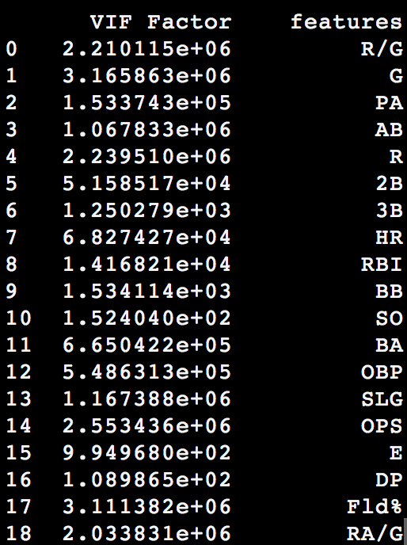
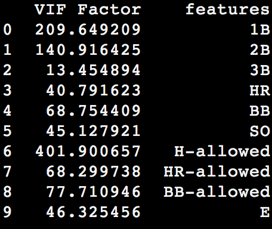

# Capstone I

# Analyzing MLB statistics to predict wins

### - 30 teams in MLB since 1998
### - Took team statistics from 1998 until 2018
### - Total of 630 teams
### - Offensive and defensive stats
###### - Team, Year, Wins, Losses, R/G, PA, AB, R, H, 2B, 3B, HR, RBI, SB, BB, OBP, SLG, OPS, RA/G, ERA, H-allowed, SO-pitched, WHIP, etc.
### - Goal: Predict number of wins for a team in a season based on stats from above

# Variance Inflation Factors (VIFs)

<!--  -->

# Eliminate Features

### Used cumulative stats rather than averages

###### 1B, 2B, 3B, HR, BB, SO, H-allowed, HR-allowed, BB-allwoed, Errors

<!--  -->

<!--  -->

# EDA

### Offensive stats

<!--  -->

### Defensive / Pitching stats

<!--  -->

# Lasso Regression

##### Training R-squared: 0.812
##### Training best alpha: 0.002
##### Test R-squared: 0.822

<!--  -->

# Ridge Regression

##### Training R-squared: 0.812
##### Training best alpha: 8.286
##### Test R-squared: 0.821

<!--  -->

# Predicted vs. Actual

#### Predicted target (Wins) from Ridge and Lasso models
- ridge.predict(X_std)
- lasso.predict(X_std)

#### Compared predicted targets from model to actual targets
- Ridge RMSLE: 0.063
- Lasso RMSLE: 0.063
- Ridge RMSE: 5.018
- Lasso RMSE: 5.014

## Residuals

##### Scatter plot of predicted wins and residuals

<!--  -->

#### QQ plots

<!--  -->

