# Capstone I

# Analyzing MLB Statistics to Predict Wins

### - 30 teams in MLB since 1998
### - Took team statistics from 1998 until 2018
### - Total of 630 teams
### - Offensive and defensive stats
###### - Team, Year, Wins, Losses, R/G, PA, AB, R, H, 2B, 3B, HR, RBI, SB, BB, OBP, SLG, OPS, RA/G, ERA, H-allowed, SO-pitched, WHIP, etc.
### - Goal: Predict number of wins for a team in a season based on stats from above

Data Source: https://www.baseball-reference.com/

Analyze stats from the last 21 years and create a machine learning model to train on the stats and the number of wins for each team.  Test the model to predict wins for each year based on the same statistics.

# Variance Inflation Factors (VIFs)

- Set 'wins' as my target. Compared all my potential features to analyze which statistics to include in my model.

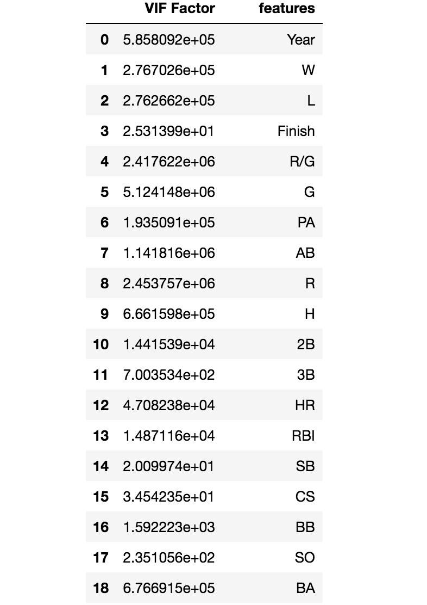

Large VIF scores displaying colinearity between features.  Need to eliminate features in order to create a better model.

# Eliminate Features

### Used cumulative stats rather than averages

###### 1B, 2B, 3B, HR, BB, SO, H-allowed, HR-allowed, BB-allowed, Errors

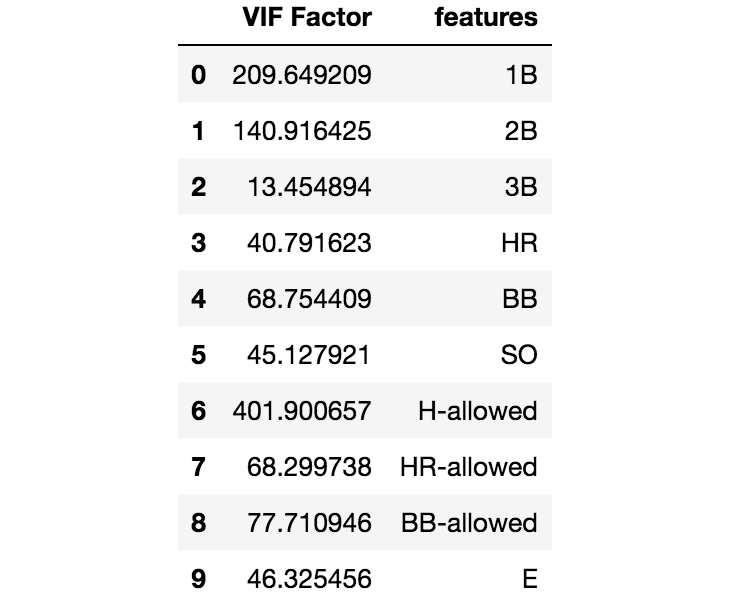

End up with ten features.  Although the features still have large VIF scores, it is more representative for the model.

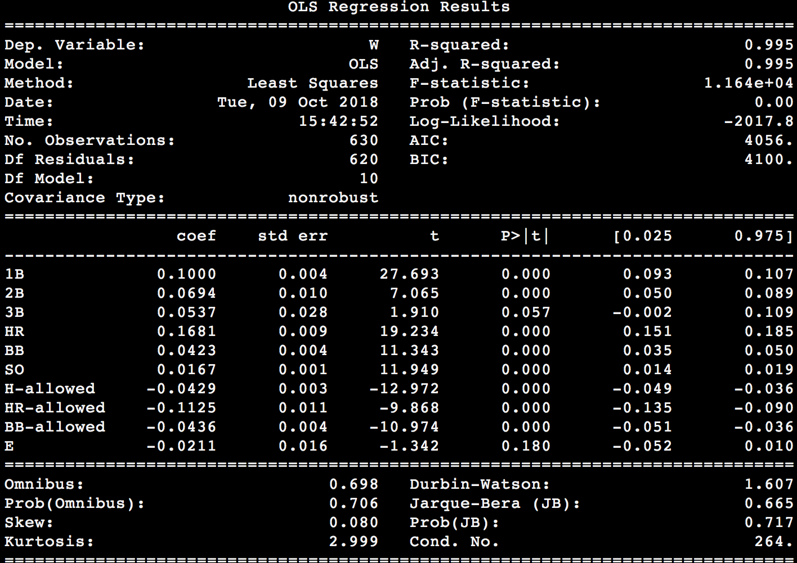

With an R-squared score close to 1.0, this model explains the majority of the response data around its mean.  Coefficients with P>|t| values of 0.00 mean each of those coefficients is very significant.  Higher P>|t| values mean the coefficients are less significant.

# EDA
Below are team statistics for each of the 30 MLB teams over 21 years (630 observations)

### Offensive stats

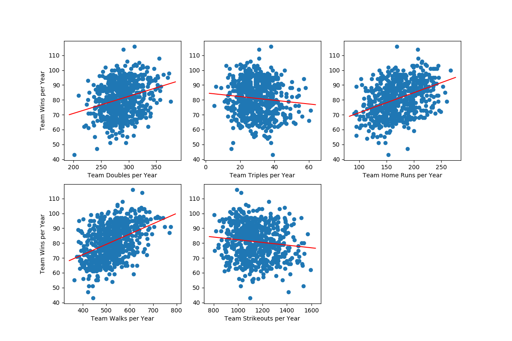

### Defensive / Pitching stats

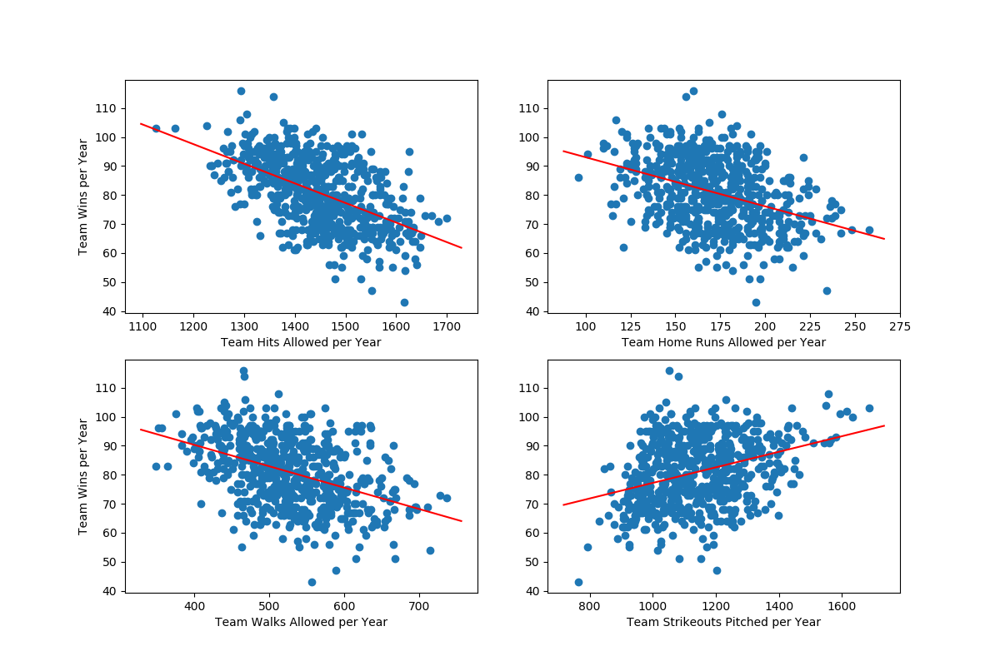

### Misc.

Teams winning 95 or more games will likely advance to the postseason, while teams winning less than 95 games are not as likely to advance.  For this reason, I broke up the teams into two categories (teams winning more than or equal to 95 games and teams winning less than 95 games).  I then compared major offensive statistics between the two categories and created a visualization.

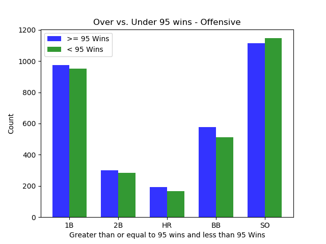

##### The visualizations below compare cumulative league statistics for each season over the past 21 seasons (offensive).

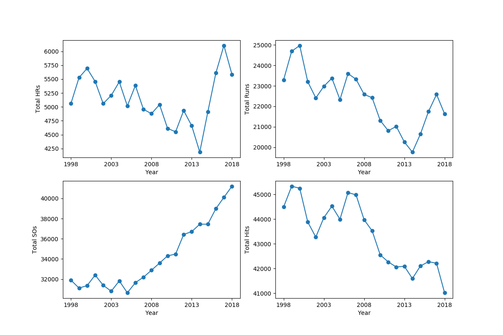

# Regularization

Regularization is adding information to the model to prevent overfitting, reduce co-linearity, and adjust the bias/variance trade-off.  I experimented with L1 Regularization (LASSO) and L2 Regularization (Ridge).

## LASSO Regression

##### Training R-squared: 0.812
##### Training best alpha: 0.002
##### Test R-squared: 0.822

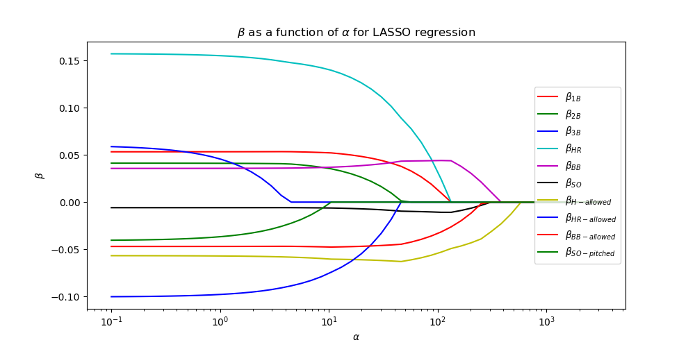

## Ridge Regression

##### Training R-squared: 0.812
##### Training best alpha: 8.286
##### Test R-squared: 0.821

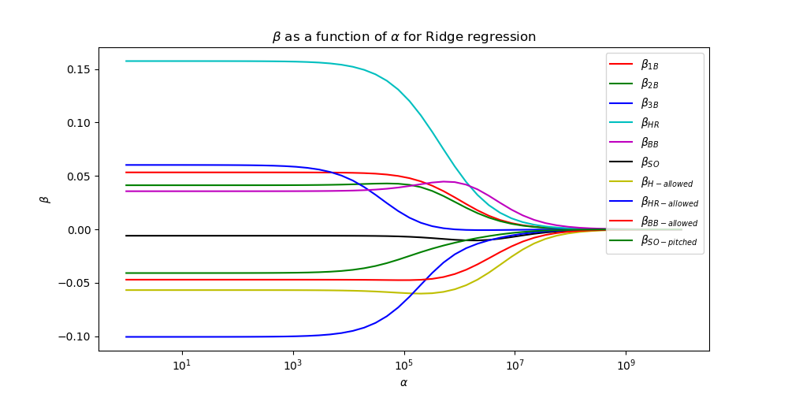

# Predicted vs. Actual

#### Predicted target (Wins) from Ridge and Lasso models
- ridge.predict(X_std)
- lasso.predict(X_std)

#### Compared predicted targets from model to actual targets
- Ridge RMSLE: 0.063
- Lasso RMSLE: 0.063
- Ridge RMSE: 5.018
- Lasso RMSE: 5.014

## Residuals

##### Scatter plot of predicted wins and residuals

These plots show homoscedasticity, which means our residuals are normally distributed, which is an important assumption behind linear regression.

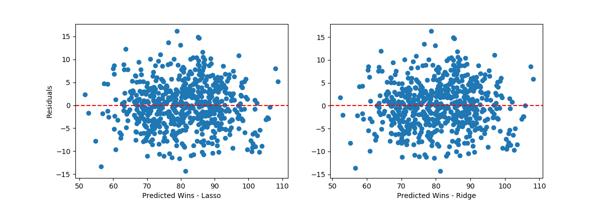

#### QQ plots

The linearity of the points show the data are normally distributed.

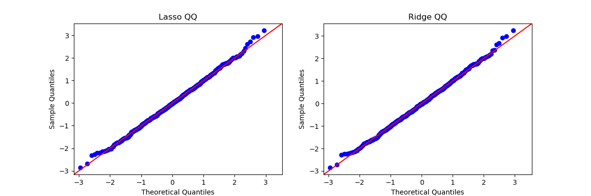

# Can we do better?

#### Re-ran Ridge and Lasso models
##### Trained on new features (OPS, ERA, WHIP, RBI, E)
##### Ridge / Lasso
- Training R-squared: 0.873 / 0.873
- Test R-squared: 0.902 / 0.902
- RMSE: 4.013 / 4.010

RMSE of approximately four means the model was able to predict how many games a team would win in a season, and the prediction was usually off by four games.  Considering teams play 162 games in a year, this is pretty impressive!

### My model's predictions vs. actual wins of teams for the 2018 season.

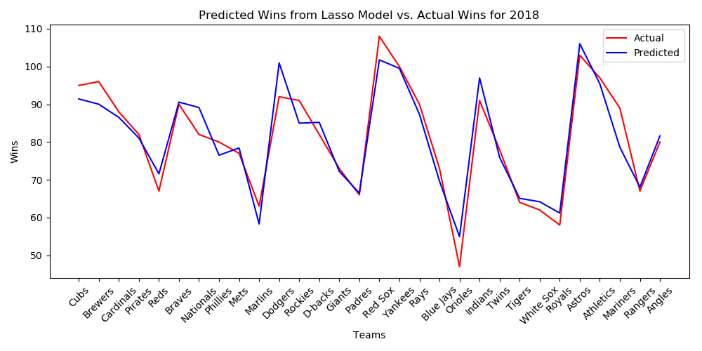
